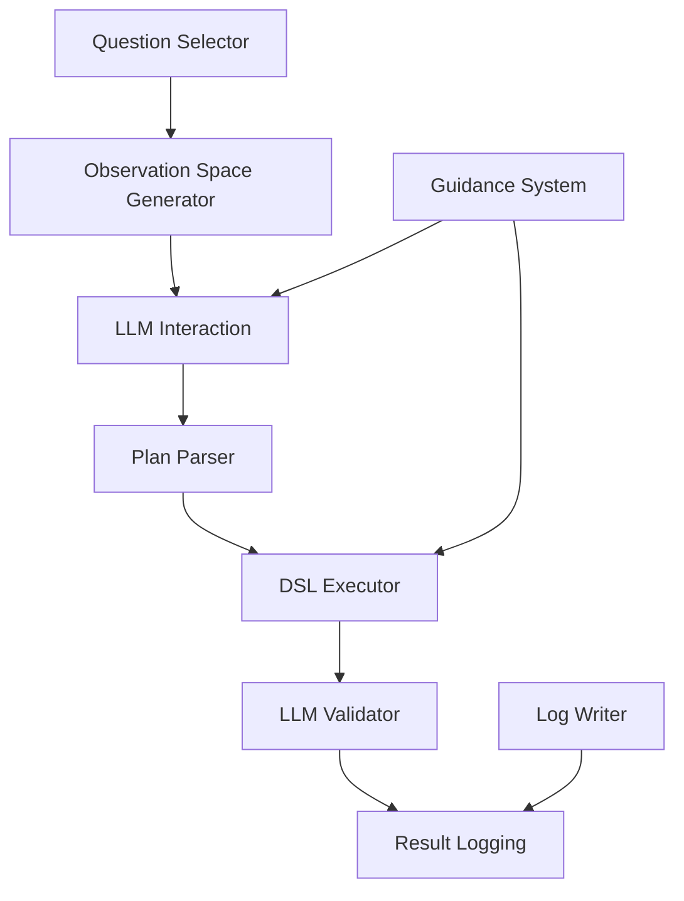

## Module: Evaluation

### Overview
The `src/evaluation` module is the **core engine** of the Q&A evaluation framework, providing comprehensive functionality for evaluating LLM performance on complex reasoning tasks over tabular data. This module handles everything from question selection and observation space generation to DSL execution and result validation.

**Responsibilities:**
- Question selection and filtering from various sources
- Observation space generation for table data presentation
- DSL parsing and execution for table reasoning
- LLM response validation and scoring
- Error guidance and stubborn behavior detection
- Structured logging of evaluation results

**Non-responsibilities:**
- LLM model management (handled by external APIs)
- Data preprocessing (handled by `src/data_processing`)
- Configuration management (handled by `src/utils/config`)

### Architecture & Key Components



- [`question_selector.py`](question_selector.py): Handles question selection from various sources with configurable modes. Guarantees deterministic question ordering based on seed.
- [`observation_space.py`](observation_space.py): Generates observation spaces for table data presentation. Supports multiple modes and provides rich metadata.
- [`dsl_executor.py`](dsl_executor.py): Parses and executes DSL commands for table reasoning. Implements fuzzy matching and error handling.
- [`plan_parser.py`](plan_parser.py): Extracts PLAN and END blocks from LLM responses with robust prefix cleaning.
- [`llm_validator.py`](llm_validator.py): Validates model responses against gold answers using configurable LLM models.
- [`guidance.py`](guidance.py): Provides intelligent error guidance with stubborn behavior detection.
- [`log_writer.py`](log_writer.py): Handles structured logging of evaluation results to JSONL files.

### Configuration
- [`configs/qna.yaml`](../../configs/qna.yaml)
  - `qna.obs.mode`: {full_table, header_5, header_1} - Observation space mode
  - `qna.obs.max_rows_per_table`: Maximum rows to display (default: 1000)
  - `qna.obs.include_description`: Include table descriptions (default: true)
  - `qna.run.repeated_plan_threshold`: Threshold for repeated plan detection (default: 3)
  - `qna.run.stubborn_threshold`: Threshold for stubborn behavior detection (default: 3)
  - `qna.run.stubborn_termination_threshold`: Termination threshold for stubborn behavior (default: 5)
  - `qna.validator.model`: LLM model for validation (default: "llama3")
  - `qna.validator.timeout_s`: Validation timeout in seconds (default: 30.0)

### Logging
- This module uses [`src/utils/logging_utils.py`](../utils/logging_utils.py) for structured logging.
- Logs are emitted to timestamped files under `logs/` and mirrored to the terminal.
- Logging levels: INFO for user-facing progress; DEBUG for full LLM responses and diagnostics.
- Evaluation results are written to JSONL files in `experiments/results/` with structured schemas.

### Public API & Contracts
- [`SelectionConfig`](question_selector.py#L28) `(mode: str, root: Path, custom_specs: List[str], seed: int)`
  - Configuration for question selection with deterministic ordering based on seed.
- [`collect_question_records()`](question_selector.py#L119) `(cfg: SelectionConfig) -> List[Dict[str, Any]]`
  - Returns question records with question_id, table_refs, question, answer. Returns empty list on invalid config.
- [`ObservationSpaceGenerator.generate_obs_for_question()`](observation_space.py#L48) `(question_record: Dict[str, Any]) -> Dict[str, str]`
  - Returns observation space with visible_columns_desc, visible_rows_desc, table_stats_desc, table_structures. Returns error dict on table loading failures.
- [`parse_plan_or_end()`](plan_parser.py#L7) `(text: str, plan_executed: bool = False) -> Tuple[str, str]`
  - Returns (kind, content) where kind in {PLAN, END} or (ERROR, code). Returns (ERROR, "FORMAT_NO_BLOCK") on invalid input.
- [`execute_plan()`](dsl_executor.py#L538) `(plan_text: str, table_refs: List[str] = None) -> pd.DataFrame`
  - Returns executed DataFrame. Raises ValueError with detailed error messages on execution failures.
- [`LLMValidator.validate()`](llm_validator.py#L130) `(question: str, gold_answer: str, model_answer: str, allow_retry: bool = True) -> ValidationResult`
  - Returns ValidationResult with decision (True/False/None), time_s, retried, error. Returns None decision on timeout or invalid response.
- [`guidance_for()`](guidance.py#L4) `(error_code: str, failed_plan_count: int = 0) -> str`
  - Returns guidance message for error code. Returns stubborn behavior message when failed_plan_count >= 3.

### Data Inputs/Outputs
- **Inputs**: Question JSON files from `data/questions/` with schema: `{question_id, table_refs, question, answer}`
- **Outputs**: 
  - JSONL files in `experiments/results/{timestamp}/question_XXX.jsonl` with evaluation records
  - Batch info files in `experiments/results/{timestamp}/batch_info_{timestamp}.txt`
  - Prompt dumps in `experiments/results/{timestamp}/prompt_dumps/`
  - Log files in `logs/{timestamp}.log`
- **Table Data**: CSV files from `data/tables/{table_id}/table.csv` with metadata in `meta.json`

### Entry Points
- **CLI Usage**: 
```bash
uv run python scripts/qna_runner.py --config configs/qna.yaml
uv run python scripts/qna_runner.py --config configs/qna.yaml --batch-size 10 --continue-from 217
```
- **Python API**: 
```python
from src.evaluation import ObservationSpaceGenerator, execute_plan, parse_plan_or_end
generator = ObservationSpaceGenerator(config, data_root=Path("data/tables"))
obs = generator.generate_obs_for_question(question_record)
result_df = execute_plan(plan_text, table_refs)
```

### Extensibility Guidelines
- **Adding New DSL Commands**: Extend `parse_plan()` and `execute_plan()` in `dsl_executor.py` with new command parsing and execution logic.
- **Custom Observation Spaces**: Inherit from `ObservationSpaceGenerator` and override `_generate_obs_for_dataframe()` for custom data presentation.
- **New Validation Methods**: Extend `LLMValidator` or create custom validators implementing the same interface.
- **Additional Error Codes**: Add new error codes to `guidance.py` with corresponding guidance messages.
- **Coding Style**: Use descriptive names, early returns, minimal try/except blocks, no broad exception swallowing, document non-obvious rationale only.

### **1. Observation Space Generator** - **Critical Component**
**File**: `observation_space.py`

Generates different observation spaces for presenting table data to LLMs during evaluation.

#### **Key Features**:
- **Multiple Observation Modes**: `full_table`, `header_5`, `header_1`
- **Multi-table Support**: Handles both single and multi-table scenarios
- **Rich Metadata**: Table statistics, structure information, and descriptions
- **Configurable Sampling**: Head/tail balanced or random sampling strategies

#### **Configuration**:
```python
@dataclass
class ObsConfig:
    mode: str  # "full_table", "header_5", "header_1"
    max_rows_per_table: int = 1000
    sample_strategy: str = "head_tail_balanced"
```

#### **Output Format**:
```python
{
    "visible_columns_desc": "Available columns: col1, col2, col3",
    "visible_rows_desc": "Sample data (first 5 rows of 1000):\n...",
    "table_stats_desc": "rows: 1000 | cols: 5 | Numeric columns: 3",
    "table_description": "table_001: Global GDP Data (1990–2020)",
    "table_structures": {
        "table_001": {
            "columns": ["Country", "Year", "GDP"],
            "dtypes": ["object", "int64", "float64"],
            "sample_values": {"Country": "USA", "Year": "2020", "GDP": "21.4"},
            "row_count": 1000,
            "null_counts": {"Country": 0, "Year": 0, "GDP": 5}
        }
    }
}
```

#### **Usage Example**:
```python
from src.evaluation import ObservationSpaceGenerator

generator = ObservationSpaceGenerator(config, data_root=Path("data/tables"))
obs = generator.generate_obs_for_question(question_record)
```

---

### **2. DSL Executor** - **Most Complex Component**
**File**: `dsl_executor.py`

A comprehensive Domain Specific Language (DSL) parser and executor for table reasoning operations.

#### **Supported DSL Commands**:

| Command | Syntax | Description |
|---------|--------|-------------|
| `load` | `load(table_id)` | Load a table from data/tables/table_id/table.csv |
| `load_as` | `load_as(table_id, alias)` | Load table with alias for later reference |
| `select` | `select(col1, col2, ...)` | Select specific columns |
| `filter` | `filter(col op value)` | Filter rows with condition |
| `filter_all` | `filter_all(expr1; expr2; ...)` | AND multiple conditions |
| `filter_any` | `filter_any(expr1; expr2; ...)` | OR multiple conditions |
| `groupby` | `groupby(col1, col2, ...)` | Group by columns |
| `agg` | `groupby().agg({sum: "col"})` | Aggregate functions |
| `join` | `join(left, right, on=cols, how=type)` | Join tables |
| `order` | `order(col1, col2, ascending=True)` | Sort by columns |
| `derive` | `derive(new_col = "A" + "B")` | Create calculated columns |
| `limit` | `limit(n)` | Limit number of rows |
| `save` | `save(alias)` | Save current dataframe as alias |
| `use` | `use(alias)` | Switch to saved dataframe |

#### **Advanced Features**:

**Fuzzy Column Matching**:
```python
# Automatically resolves column name variations
"Country Name" → "Country Name" (exact match)
"country" → "Country Name" (case-insensitive)
"Country" → "Country Name" (fuzzy match)
```

**Auto-quoting**:
```python
# Automatically adds quotes to column names with spaces
order(Country Name, ascending=False)  # → order("Country Name", ascending=False)
select(Total GDP, Population)         # → select("Total GDP", "Population")
```

**Table Name Mapping**:
```python
# Maps common placeholders to actual table names
table_T → table_001 (when only one table available)
table → table_001 (fallback mapping)
```

**Parameter Compatibility**:
```python
# Converts incompatible parameters
order(col, descending=True)  # → order(col, ascending=False)
```

#### **Error Handling**:
```python
class ColumnNameError(Exception):
    """Special error for column name mismatches"""
    def __init__(self, requested_col: str, available_cols: List[str], suggestions: List[str] = None)
```

#### **Usage Example**:
```python
from src.evaluation import execute_plan, parse_plan

# Parse DSL plan
plan = """
load(table_001)
select("Country", "GDP")
filter(Year == 2020)
groupby().agg({sum: "GDP"})
limit(10)
"""

# Execute plan
result_df = execute_plan(plan, table_refs=["table_001"])
```

---

### **3. Plan Parser**
**File**: `plan_parser.py`

Robust parser for extracting PLAN and END blocks from LLM responses.

#### **Supported Formats**:

**PLAN Blocks**:
```
PLAN
load(table_001)
select("Country", "GDP")
filter(Year == 2020)
END PLAN
```

**END Blocks**:
```
END
The answer is 42
END
```

**Markdown Variants**:
```
**PLAN**
load(table_001)
select("Country", "GDP")
**END**

## PLAN
load(table_001)
select("Country", "GDP")
## END
```

#### **Intelligent Handling**:
- **Prefix Cleaning**: Removes "Here is the solution:", "Let me try:", etc.
- **Format Standardization**: Converts various formats to standard DSL
- **Simultaneous Blocks**: Smart handling when both PLAN and END are present
- **Incomplete Plans**: Handles plans without proper END markers

#### **Usage Example**:
```python
from src.evaluation import parse_plan_or_end

text = """
Here is my solution:
PLAN
load(table_001)
select("Country", "GDP")
END PLAN
"""

kind, content = parse_plan_or_end(text, plan_executed=False)
# Returns: ("PLAN", "load(table_001)\nselect(\"Country\", \"GDP\")")
```

---

### **4. Question Selector**
**File**: `question_selector.py`

Flexible question selection system supporting multiple modes and custom specifications.

#### **Selection Modes**:

| Mode | Description | Path Pattern |
|------|-------------|--------------|
| `all` | All questions | `data/questions/**/question_*.json` |
| `single_table` | Single table questions | `data/questions/single_table/question_*.json` |
| `multi_table` | Multi-table questions | `data/questions/multi_table/**/question_*.json` |
| `distractor` | Distractor questions | `data/questions/distractor_bank/**/question_*.json` |
| `custom` | Custom ID specifications | Parsed from `custom_specs` |

#### **Custom ID Specifications**:
```python
# Examples of custom_specs
["1", "2-5", "10"]        # Questions 1, 2, 3, 4, 5, 10
["1-3", "7", "10-12"]     # Questions 1, 2, 3, 7, 10, 11, 12
["1", "5-7", "10"]        # Questions 1, 5, 6, 7, 10
```

#### **Usage Example**:
```python
from src.evaluation import SelectionConfig, collect_question_records

config = SelectionConfig(
    mode="custom",
    root=Path("data/questions"),
    custom_specs=["1-5", "10"],
    seed=42
)

records = collect_question_records(config)
```

---

### **5. LLM Validator**
**File**: `llm_validator.py`

LLM-based validator for evaluating model response correctness.

#### **Key Features**:
- **Strict Output Format**: Must output exactly "True" or "False"
- **Robust Comparison**: Handles case-insensitive, punctuation, boolean synonyms
- **Retry Mechanism**: Automatic retry with stricter prompts
- **Timeout Handling**: Configurable timeout per validation

#### **Validation Rules**:
- **Case-insensitive comparison**
- **Ignore trailing punctuation** (., !, ?)
- **Boolean synonyms**: yes/true, no/false
- **Numeric equivalence**: "3" vs "three"
- **List comparison**: Order-insensitive set comparison

#### **Usage Example**:
```python
from src.evaluation import LLMValidator

validator = LLMValidator(model="llama3", timeout_s=30.0)
result = validator.validate(
    question="What is the capital of France?",
    gold_answer="Paris",
    model_answer="The capital is Paris"
)
# Returns: ValidationResult(decision=True, time_s=2.5, retried=False)
```

---

### **6. Guidance System**
**File**: `guidance.py`

Intelligent error guidance system with stubborn behavior detection.

#### **Error Codes**:

| Code | Description | Guidance |
|------|-------------|----------|
| `LLM_TIMEOUT` | LLM response timeout | "Respond faster. Output exactly one block only." |
| `FORMAT_NO_BLOCK` | No valid block found | "Start directly with PLAN or END. No prefixes." |
| `PLAN_SYNTAX` | DSL syntax errors | "Use exact column names with quotes. Check parentheses." |
| `EXEC_ERROR` | Execution failed | "Use derive() for calculations. Check table/column names." |
| `COLUMN_NAME_ERROR` | Column not found | "Use exact column names from table structure." |

#### **Stubborn Behavior Detection**:
```python
# After 3+ failed attempts with same error
if failed_plan_count >= 3:
    return f"STUBBORN BEHAVIOR DETECTED: You've made the same error {failed_plan_count} times. You MUST try a completely different approach."
```

#### **Usage Example**:
```python
from src.evaluation import guidance_for

guidance = guidance_for("PLAN_SYNTAX", failed_plan_count=2)
# Returns: "Your PLAN has DSL syntax errors. Common issues: 1) Use exact column names with quotes..."
```

---

### **7. Log Writer**
**File**: `log_writer.py`

Utility functions for writing structured log data.

#### **Functions**:
- `write_jsonl_append()`: Append records to JSONL files
- `write_json_pretty()`: Write formatted JSON files

#### **Usage Example**:
```python
from src.evaluation import write_jsonl_append

record = {
    "question_id": 1,
    "status": "SUCCESS",
    "answer": "42",
    "execution_time": 1.5
}
write_jsonl_append("results/question_001.jsonl", record)
```

---

## **Usage Examples**

### **Basic Evaluation Pipeline**:
```python
from src.evaluation import (
    SelectionConfig, collect_question_records,
    ObservationSpaceGenerator, parse_plan_or_end,
    execute_plan, LLMValidator
)

# 1. Select questions
config = SelectionConfig(mode="single_table", root=Path("data/questions"), custom_specs=[], seed=42)
records = collect_question_records(config)

# 2. Generate observation space
obs_generator = ObservationSpaceGenerator(config, data_root=Path("data/tables"))
obs = obs_generator.generate_obs_for_question(records[0])

# 3. Parse LLM response
kind, content = parse_plan_or_end(llm_response, plan_executed=False)

# 4. Execute DSL plan
if kind == "PLAN":
    result_df = execute_plan(content, table_refs=records[0]["table_refs"])

# 5. Validate result
validator = LLMValidator(model="llama3")
validation_result = validator.validate(
    question=records[0]["question"],
    gold_answer=records[0]["answer"],
    model_answer=final_answer
)
```

### **Advanced DSL Usage**:
```python
# Complex multi-table analysis
plan = """
load_as(table_001, countries)
load_as(table_002, gdp_data)
join(countries, gdp_data, on="Country", how="inner")
filter(Year >= 2020)
groupby("Region").agg({sum: "GDP", mean: "Population"})
order("sum_GDP", ascending=False)
limit(10)
"""

result = execute_plan(plan, table_refs=["table_001", "table_002"])
```

---

## **Configuration**

### **Observation Space Configuration**:
```yaml
qna:
  obs:
    mode: "header_5"              # full_table, header_5, header_1
    max_rows_per_table: 1000
    include_description: true
```

### **DSL Executor Configuration**:
```yaml
qna:
  run:
    repeated_plan_threshold: 3
    stubborn_threshold: 3
    stubborn_termination_threshold: 5
```

### **Validator Configuration**:
```yaml
qna:
  validator:
    model: "llama3"
    timeout_s: 30.0
```

---

## **Debugging and Troubleshooting**

### **Common Issues**:

**1. Column Name Errors**:
```python
# Problem: Column name not found
# Solution: Use exact column names with quotes
select("Country Name")  # Correct
select(Country Name)    # Incorrect
```

**2. DSL Syntax Errors**:
```python
# Problem: Incorrect aggregation syntax
# Solution: Use proper groupby().agg() syntax
groupby().agg({sum: "GDP"})  # Correct
derive(total = sum("GDP"))   # Incorrect
```

**3. Table Loading Errors**:
```python
# Problem: Table not found
# Solution: Check table_refs and file paths
load(table_001)  # Correct (if table exists)
load(table_999)  # Incorrect (if table doesn't exist)
```

### **Debug Tools**:
```python
# Enable debug logging
import logging
logging.basicConfig(level=logging.DEBUG)

# Check table structure
obs = obs_generator.generate_obs_for_question(record)
print(obs["table_structures"])

# Test DSL parsing
try:
    commands = parse_plan(plan_text)
    print(f"Parsed {len(commands)} commands")
except Exception as e:
    print(f"Parse error: {e}")
```

---

## **Extension and Customization**

### **Adding New DSL Commands**:
```python
# 1. Add command to parse_plan()
elif name == "custom_command":
    args = _split_args(args_raw)
    commands.append(DSLCommand("custom_command", (args,), {}))

# 2. Add execution logic to execute_plan()
elif cmd.name == "custom_command":
    # Custom execution logic
    pass
```

### **Custom Observation Spaces**:
```python
class CustomObservationGenerator(ObservationSpaceGenerator):
    def _generate_obs_for_dataframe(self, df: pd.DataFrame, table_id: str) -> Dict[str, str]:
        # Custom observation space logic
        return super()._generate_obs_for_dataframe(df, table_id)
```

### **Custom Validators**:
```python
class CustomValidator(LLMValidator):
    def validate(self, question: str, gold_answer: str, model_answer: str) -> ValidationResult:
        # Custom validation logic
        return super().validate(question, gold_answer, model_answer)
```

---

### Related Documentation
- [`scripts/README.md`](../../scripts/README.md) for CLI usage and qna_runner.py documentation
- [`experiments/results/README.md`](../../experiments/results/README.md) for output file schemas and formats
- [`logs/README.md`](../../logs/README.md) for log file formats and analysis tools
- [`configs/README.md`](../../configs/README.md) for configuration details and parameters
- [`data/tables/README.md`](../../data/tables/README.md) for table data schema and structure

---

## **Contributing**

When extending the evaluation module:

1. **Follow the existing patterns** for error handling and logging
2. **Add comprehensive tests** for new functionality
3. **Update this documentation** with new features
4. **Consider backward compatibility** when making changes
5. **Use type hints** for better code clarity

---

*This module is the heart of the Q&A evaluation framework, providing robust, flexible, and extensible functionality for evaluating LLM performance on complex reasoning tasks.*

